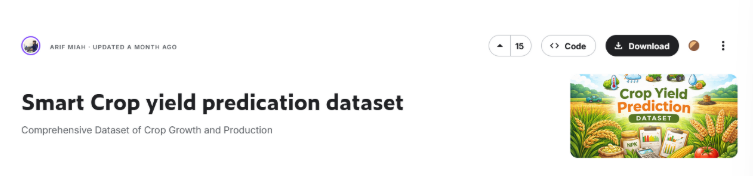

# **PR0503. Limpieza de datos sobre dataset de cultivos**

## **Dataset 1: Datos para la predicción del rendimiento en cultivos**



Supón que queremos preparar los datos de nuestro dataset de cultivos para un modelo de redes neuronales y nos han pedido cuatro transformaciones específicas:
- Generar identificadores únicos estandarizados
- Normalizar las distribuciones numéricas
- Comparar insumos
- Proyectar fechas de cosecha


```python
from pyspark.sql import SparkSession

try:
    spark = ( SparkSession.builder
    .appName("Haciendo pruebas")
    .master("spark://spark-master:7077")
    .getOrCreate()
    )

    print("SparkSession iniciada correctamente.")
except Exception as e:
    print("Error en la conexión")
    print()

from pyspark.sql.types import StructType, StructField, StringType, DoubleType, LongType

schema = StructType([
    StructField("Crop",StringType(),True),
    StructField("Region",StringType(),True),
    StructField("Soil_Type",StringType(),True),
    StructField("Soil_pH",DoubleType(),True),
    StructField("Rainfall_mm",DoubleType(),True),
    StructField("Temperature_C",DoubleType(),True),
    StructField("Humidity_pct",DoubleType(),True),
    StructField("Fertilizer_Used_kg",DoubleType(),True),
    StructField("Irrigation",StringType(),True),
    StructField("Pesticides_Used_kg",DoubleType(),True),
    StructField("Planting_Density",DoubleType(),True),
    StructField("Previous_Crop",StringType(),True),
    StructField("Yield_ton_per_ha",DoubleType(),True)
])

df_cultivos = (spark.read
    .format("csv")
    .schema(schema)
    .option("header", "true")
    .option("quote", "\"")
    .load("./crop_yield_dataset.csv")
)

df_cultivos.printSchema()

df_cultivos.show(5)


```

    SparkSession iniciada correctamente.
    root
     |-- Crop: string (nullable = true)
     |-- Region: string (nullable = true)
     |-- Soil_Type: string (nullable = true)
     |-- Soil_pH: double (nullable = true)
     |-- Rainfall_mm: double (nullable = true)
     |-- Temperature_C: double (nullable = true)
     |-- Humidity_pct: double (nullable = true)
     |-- Fertilizer_Used_kg: double (nullable = true)
     |-- Irrigation: string (nullable = true)
     |-- Pesticides_Used_kg: double (nullable = true)
     |-- Planting_Density: double (nullable = true)
     |-- Previous_Crop: string (nullable = true)
     |-- Yield_ton_per_ha: double (nullable = true)
    


    [Stage 0:>                                                          (0 + 1) / 1]

    +------+--------+---------+-------+-----------+-------------+------------+------------------+----------+------------------+----------------+-------------+----------------+
    |  Crop|  Region|Soil_Type|Soil_pH|Rainfall_mm|Temperature_C|Humidity_pct|Fertilizer_Used_kg|Irrigation|Pesticides_Used_kg|Planting_Density|Previous_Crop|Yield_ton_per_ha|
    +------+--------+---------+-------+-----------+-------------+------------+------------------+----------+------------------+----------------+-------------+----------------+
    | Maize|Region_C|    Sandy|   7.01|     1485.4|         19.7|        40.3|             105.1|      Drip|              10.2|            23.2|         Rice|          101.48|
    |Barley|Region_D|     Loam|   5.79|      399.4|         29.1|        55.4|             221.8| Sprinkler|              35.5|             7.4|       Barley|          127.39|
    |  Rice|Region_C|     Clay|   7.24|      980.9|         30.5|        74.4|              61.2| Sprinkler|              40.0|             5.1|        Wheat|           68.99|
    | Maize|Region_D|     Loam|   6.79|     1054.3|         26.4|        62.0|             257.8|      Drip|              42.7|            23.7|         None|          169.06|
    | Maize|Region_D|    Sandy|   5.96|      744.6|         20.4|        70.9|             195.8|      Drip|              25.5|            15.6|        Maize|          118.71|
    +------+--------+---------+-------+-----------+-------------+------------+------------------+----------+------------------+----------------+-------------+----------------+
    only showing top 5 rows
    


                                                                                    

### **1.- Creación de un ID único**

Necesitamos un código único para cada registro que sirva como clave primaria. Crea una nueva columna llamada ``Crop_ID`` en un nuevo DataFrame ``df_eng``. Este ID debe seguir este formato estricto: ``CODIGO_REGION-CULTIVO``.
- **Limpieza**: de la columna ``Region`` (ej. “Region_C”), elimina la palabra “Region_” y quédate solo con la letra (puedes usar ``substring`` o ``split``).
- **Formato**: convierte el nombre del cultivo (``Crop``) a mayúsculas (``upper``).
- **Concatenación**: une la letra de la región y el cultivo con un guion medio (``concat_ws``).
- **Relleno**: si por algún motivo la letra de la región fuera muy corta (improbable aquí, pero por seguridad), asegúrate de que esa parte tenga al menos 3 caracteres rellenando con ‘X’ a la izquierda (``lpad``). Nota: Como en este dataset es solo una letra, el lpad rellenará con dos X, ej: “XXC”.

Un ejemplo de cómo quedaría una valor de este campo es CODIGO_XXC-MAIZE


```python
from pyspark.sql import functions as F
from pyspark.sql.functions import col, lit, upper, split, concat, concat_ws, lpad

df_eng = (df_cultivos
    .withColumn("Region", split(col("Region"), "_")[1])          
    .withColumn("crop", upper(col("Crop")))                      
    .withColumn("Crop_ID", concat_ws("-", concat(lit("CODIGO_"), lpad(col("Region"), 3, "X")), col("crop")))
)
df_eng.show(5)
```

    +------+------+---------+-------+-----------+-------------+------------+------------------+----------+------------------+----------------+-------------+----------------+-----------------+
    |  crop|Region|Soil_Type|Soil_pH|Rainfall_mm|Temperature_C|Humidity_pct|Fertilizer_Used_kg|Irrigation|Pesticides_Used_kg|Planting_Density|Previous_Crop|Yield_ton_per_ha|          Crop_ID|
    +------+------+---------+-------+-----------+-------------+------------+------------------+----------+------------------+----------------+-------------+----------------+-----------------+
    | MAIZE|     C|    Sandy|   7.01|     1485.4|         19.7|        40.3|             105.1|      Drip|              10.2|            23.2|         Rice|          101.48| CODIGO_XXC-MAIZE|
    |BARLEY|     D|     Loam|   5.79|      399.4|         29.1|        55.4|             221.8| Sprinkler|              35.5|             7.4|       Barley|          127.39|CODIGO_XXD-BARLEY|
    |  RICE|     C|     Clay|   7.24|      980.9|         30.5|        74.4|              61.2| Sprinkler|              40.0|             5.1|        Wheat|           68.99|  CODIGO_XXC-RICE|
    | MAIZE|     D|     Loam|   6.79|     1054.3|         26.4|        62.0|             257.8|      Drip|              42.7|            23.7|         None|          169.06| CODIGO_XXD-MAIZE|
    | MAIZE|     D|    Sandy|   5.96|      744.6|         20.4|        70.9|             195.8|      Drip|              25.5|            15.6|        Maize|          118.71| CODIGO_XXD-MAIZE|
    +------+------+---------+-------+-----------+-------------+------------+------------------+----------+------------------+----------------+-------------+----------------+-----------------+
    only showing top 5 rows
    


### **2: Transformación matemática**

Los valores de lluvia tienen mucha varianza y el rendimiento tiene demasiados decimales irrelevantes. Añade/Modifica las siguientes columnas en ``df_eng``:
- **``Log_Rainfall``**: calcula el logaritmo natural (``log``) de la columna ``Rainfall_mm`` + 1 (para evitar errores si hubiera un 0).
- **``Yield_Redondeado``**: redondea el rendimiento (``Yield_ton_per_ha``) a 1 solo decimal usando la función ``round``.
- **``Rendimiento_Bancario``**: crea otra columna usando ``bround`` sobre el rendimiento (sin decimales) para comparar cómo redondea Spark.


```python
df_eng = (df_eng \
    .withColumn("Log_Rainfall", F.log(F.col("Rainfall_mm") + 1)) \
    .withColumn("Yield_Redondeado", F.round(F.col("Yield_ton_per_ha"), 1)) \
    .withColumn("Rendimiento_Bancario", F.bround(F.col("Yield_ton_per_ha"), 0))
)

df_eng.select("Rainfall_mm", "Log_Rainfall","Yield_ton_per_ha", "Yield_Redondeado", "Rendimiento_Bancario").show(10)
```

    +-----------+------------------+----------------+----------------+--------------------+
    |Rainfall_mm|      Log_Rainfall|Yield_ton_per_ha|Yield_Redondeado|Rendimiento_Bancario|
    +-----------+------------------+----------------+----------------+--------------------+
    |     1485.4| 7.304112368059574|          101.48|           101.5|               101.0|
    |      399.4| 5.992464047441065|          127.39|           127.4|               127.0|
    |      980.9| 6.889489470175245|           68.99|            69.0|                69.0|
    |     1054.3| 6.961580365677045|          169.06|           169.1|               169.0|
    |      744.6| 6.614189263371381|          118.71|           118.7|               119.0|
    |      817.5|6.7074733968111895|           58.85|            58.9|                59.0|
    |     1358.2| 7.214651570357722|          173.44|           173.4|               173.0|
    |     1038.9| 6.946879833666187|          170.05|           170.1|               170.0|
    |      846.1| 6.741818751437505|           162.2|           162.2|               162.0|
    |      366.9| 5.907811162110729|          141.67|           141.7|               142.0|
    +-----------+------------------+----------------+----------------+--------------------+
    only showing top 10 rows
    


### **3.- Comparación de insumos**

Queremos saber cuál fue el insumo químico más pesado aplicado en cada parcela. Crea una columna llamada ``Max_Quimico_kg``.
- Usa la función ``greates`` para comparar, fila por fila, el valor de ``Fertilizer_Used_kg`` contra ``Pesticides_Used_kg``. El resultado debe ser el valor más alto de los dos.


```python
from pyspark.sql import functions as F

df_eng = (df_eng
    .withColumn("Max_Quimico_kg", F.greatest(F.col("Fertilizer_Used_kg"), F.col("Pesticides_Used_kg")))
         )

df_eng.select("Fertilizer_Used_kg","Pesticides_Used_kg","Max_Quimico_kg").show(10)
```

    +------------------+------------------+--------------+
    |Fertilizer_Used_kg|Pesticides_Used_kg|Max_Quimico_kg|
    +------------------+------------------+--------------+
    |             105.1|              10.2|         105.1|
    |             221.8|              35.5|         221.8|
    |              61.2|              40.0|          61.2|
    |             257.8|              42.7|         257.8|
    |             195.8|              25.5|         195.8|
    |              64.6|              16.4|          64.6|
    |             267.9|              38.6|         267.9|
    |             269.4|              16.0|         269.4|
    |             263.2|               7.4|         263.2|
    |             243.6|              41.7|         243.6|
    +------------------+------------------+--------------+
    only showing top 10 rows
    


### **4.- Simulación de fechas**

El dataset original no tiene fecha, pero sabemos que todos estos datos corresponden a la siembra del **1 de Abril de 2023**.
- Crea una columna ``Fecha_Siembra`` usando ``to_date`` sobre el literal “2023-04-01”.
- Calcula la ``Fecha_Estimada_Cosecha`` sumando 150 días a la fecha de siembra (``date_add``).
- Extrae el mes de la cosecha en una columna nueva llamada ``Mes_Cosecha`` (``month``).


```python
from pyspark.sql import functions as F

df_eng = (df_eng
    .withColumn("Fecha_Siembra", F.to_date(F.lit("2023-04-01")))
    .withColumn("Fecha_Estimada_Cosecha", F.date_add(F.col("Fecha_Siembra"), 150))
    .withColumn("Mes_Cosecha", F.month(F.col("Fecha_Estimada_Cosecha")))
         )

df_eng.select("Fecha_Siembra", "Fecha_Estimada_Cosecha", "Mes_Cosecha").show(5)
```

    +-------------+----------------------+-----------+
    |Fecha_Siembra|Fecha_Estimada_Cosecha|Mes_Cosecha|
    +-------------+----------------------+-----------+
    |   2023-04-01|            2023-08-29|          8|
    |   2023-04-01|            2023-08-29|          8|
    |   2023-04-01|            2023-08-29|          8|
    |   2023-04-01|            2023-08-29|          8|
    |   2023-04-01|            2023-08-29|          8|
    +-------------+----------------------+-----------+
    only showing top 5 rows
    


```python
spark.stop()
```


```python

```
