# **PR0602. AWS Lambda**

## **Ejercicio 1**
Crea una función Lambda que se dispare cada vez que se suba un archivo a un bucket de S3. Debe mostrar un mensaje con el siguiente texto:

```
Se ha creado el archivo {nombre_archivo} de {tamaño_en_ks} kilobytes en el bucket {nombre_bucket}
````

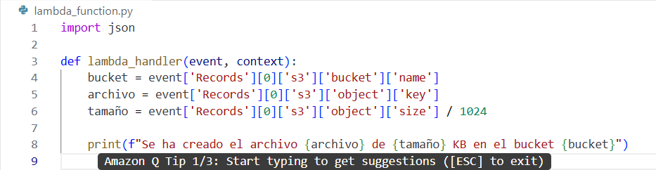

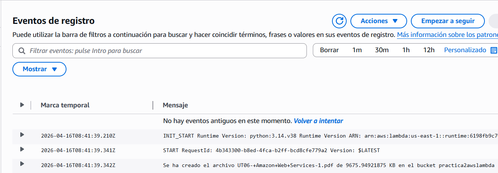

## **Ejercicio 2**
Crea una función que se dispare cuando llegue un mensaje a la cola ``MiBuzon``. La función debe imprimir:

```
He leído el mensaje: {contenido_del_mensaje}".
```

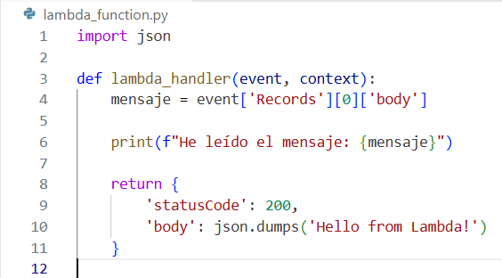

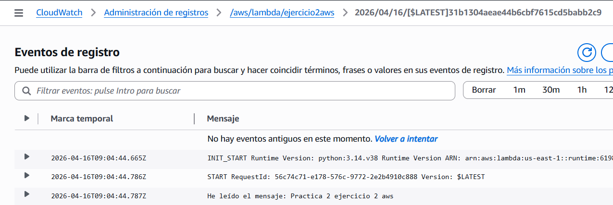

## **Ejercicio 3**
Modifica el primer ejercicio. Ahora, en lugar de imprimir solo por pantalla, la Lambda debe enviar los datos del archivo (nombre y tamaño) como un mensaje a una cola SQS llamada ``ColaDeProcesamiento``

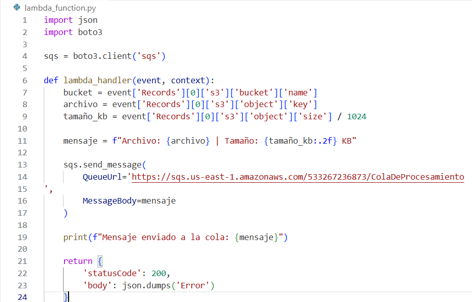

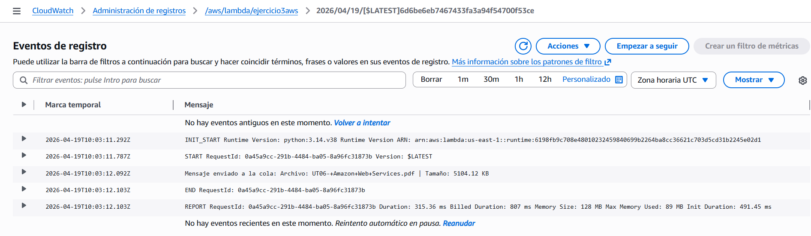

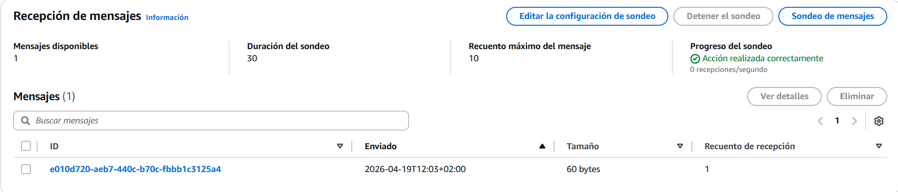

## **Ejercicio 4**
Envía un JSON a una cola SQS que contenga un campo ``prioridad`` y otro ``mensaje``. Si la prioridad es ``ALTA``, la Lambda debe imprimir: ``¡PROCESANDO URGENTE: {mensaje}!``. Si es ``BAJA``, debe imprimir: ``Registro guardado para después``.

Para enviar manualmente un mensaje a una cola simplemente debes ir a ``Enviar y recibir mensajes`` de la propia cola.

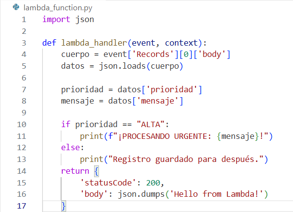

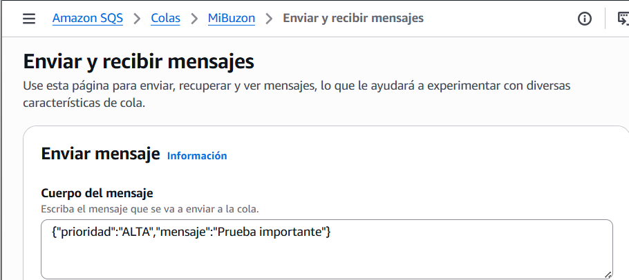

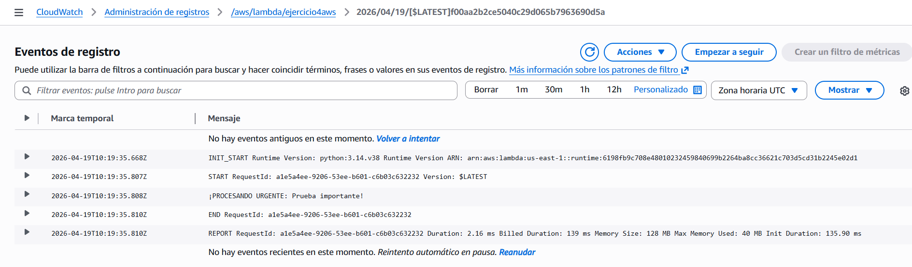

## **Ejercicio 5**
Rehaz el ejercicio anterior enviando el mensaje desde un script Python en tu equipo.

A continuación tienes un ejemplo de código sobre cómo enviar un mensaje a una cola.

```
import boto3

# Creamos el cliente de SQS
sqs = boto3.client('sqs')

# Definimos la URL de la cola
queue_url = 'URL_de_la_cola'

# Creamos un diccionario (JSON) con los datos
datos_archivo = {
    # Contenido del JSON
}

# Serializamos el diccionario
mensaje_serializado = json.dumps(datos_archivo)

# Enviamos el mensaje
response = sqs.send_message(
    QueueUrl=queue_url,
    MessageBody=mensaje_serializado
)
```


```python
import boto3
import json

sqs = boto3.client('sqs', region_name='us-east-1')

queue_url = 'https://sqs.us-east-1.amazonaws.com/533267236873/MiBuzon'

datos_archivo = {
    "prioridad": "ALTA",
    "mensaje": "Mensaje enviado desde Jupyter"
}

mensaje_serializado = json.dumps(datos_archivo)

response = sqs.send_message(
    QueueUrl=queue_url,
    MessageBody=mensaje_serializado
)
print("Mensaje enviado correctamente")
```

    Mensaje enviado correctamente


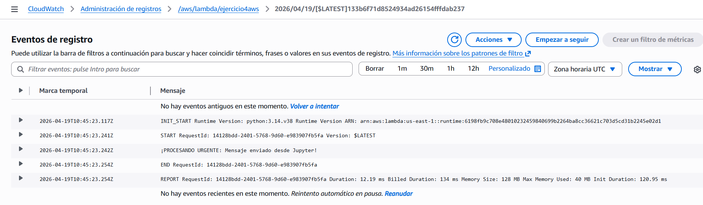

## **Ejercicio 6**
Crea una función Lambda que se ejecute todos los días a las 08:40 h que muestre el mensaje 

``Bienvenido a un nuevo día de clase``

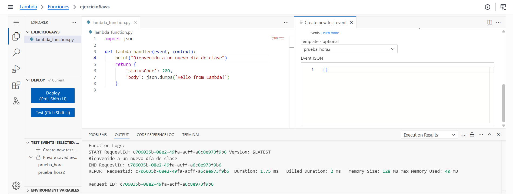

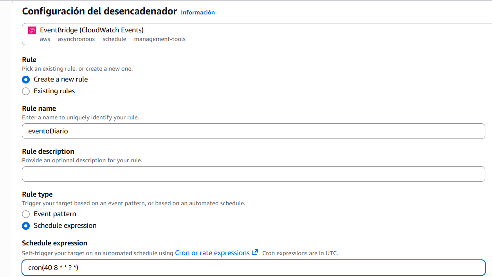

## **Ejercicio 7**
Crea una función Lambda que se ejecute todos los días y que imprima el número de archivos que hay en un bucket (puedes usar algún bucket que tengas creado por ahí). Recuerda que para obtener el listado de archivos de un bucket debes usar la función ``list_objects_v2``

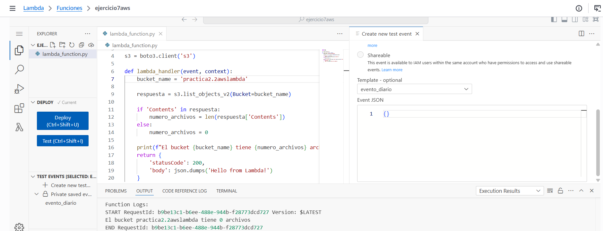

## **Ejercicio 8**
Vamos a convertir la función Lambda del primer ejercicio en un productor de mensajes. La idea es que, cada vez que se suba un archivo a S3 ejecute esta función, la cual extraerá los datos que queremos del archivo y los enviará en un mensaje a una cola.

Las tareas que tienes que realizar son:

-  **Crear la Cola (SQS)**: crea una cola estándar llamada ``ColaDeProcesamiento``.
- **Modificar la función Lambda**: crea una Lambda que capture el nombre y el tamaño del archivo, la función debe enviar un mensaje a la cola SQS con el siguiente formato de texto: 
```
Archivo registrado: {nombre_archivo} | Tamaño: {tamaño_en_kb} KB
```
- **Prueba de integración**: sube un archivo al bucket de S3. Esto disparará la Lambda, la cual enviará el mensaje a la cola.
- **Verificación en SQS**: ve a la consola de SQS, selecciona tu cola y pulsa en ``Enviar`` y ``recibir mensajes`` y ``verifica que el mensaje`` con los datos correctos ha llegado al buzón.

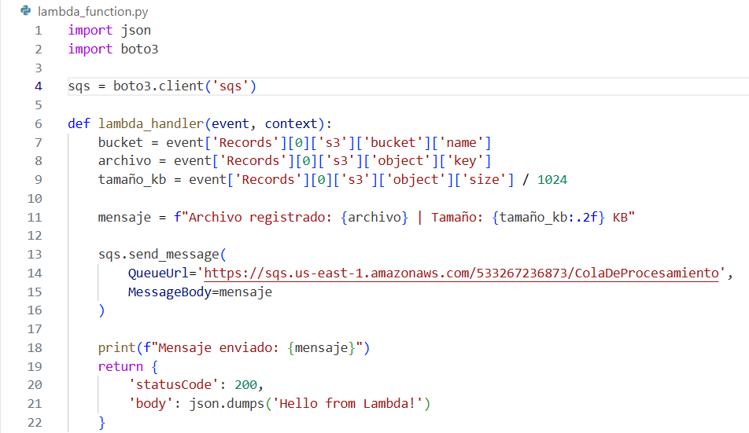

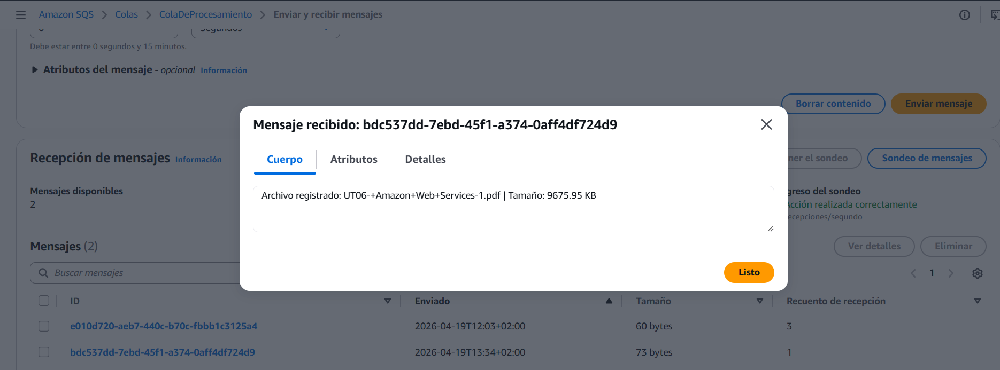


```python

```
