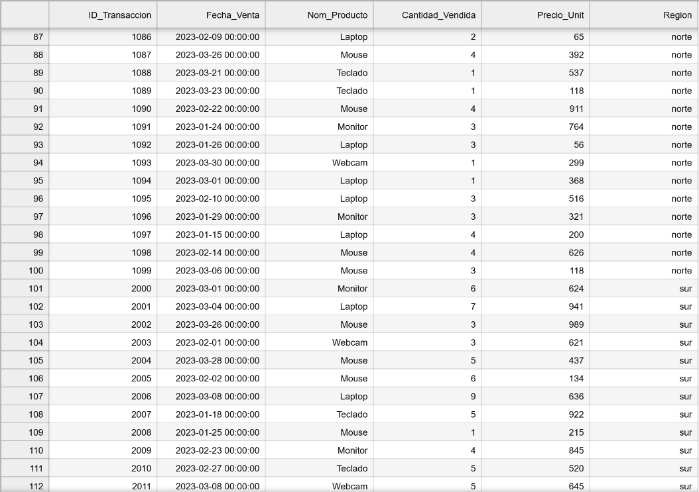
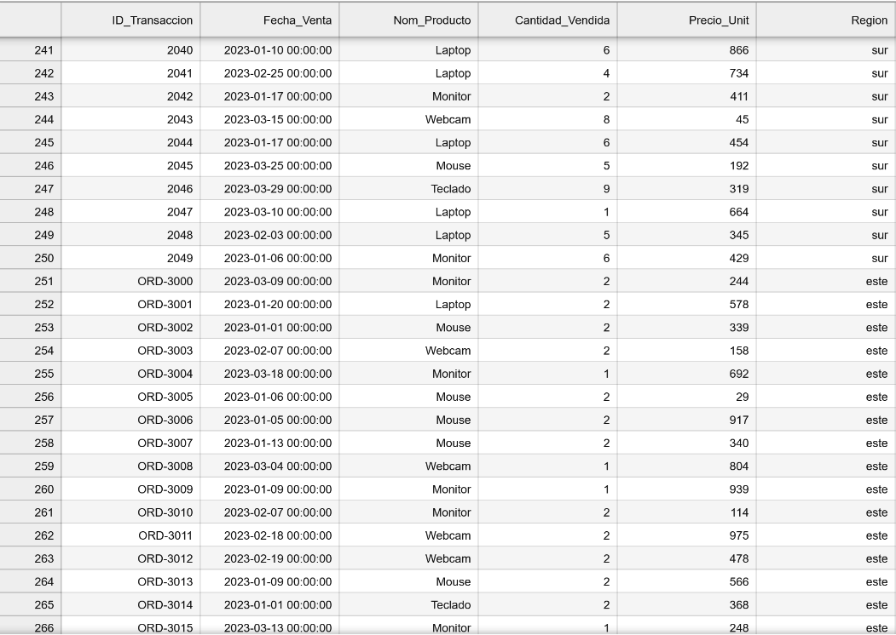

# **PR0301: Lectura de datos de archivos**

## **Objetivo de la Práctica**

Supón que trabajas para una empresa que acaba de fusionar sus operaciones de tres regiones distintas (Norte, Sur y Este). El problema es que cada región gestionaba sus datos de ventas con sistemas diferentes y necesitas un **Dataset Maestro** unificado para el Dashboard de BI.

Las fuentes de datos son:
1. **Región Norte (ventas_norte.csv)**: un sistema legado que exporta archivos de texto separados por punto y coma (**``;``**).
2. **Región Sur (ventas_sur.xlsx)**: el equipo de ventas usa Excel. El archivo contiene **múltiples pestañas** (una por mes).
3. **Región Este (ventas_este.json)**: eatos provenientes de una API moderna. La información del producto y del cliente está **anidada** dentro de diccionarios.

### **Las cosas que tienes que tener en cuenta son:**

1. **Ingesta CSV**: cargar los datos del Norte correctamente.


```python
import pandas as pd

df_norte = pd.read_csv("./ventas_norte.csv", sep=";", parse_dates=["Fecha_Venta"])
print(df_norte.head())
```

       ID_Transaccion Fecha_Venta Nom_Producto  Cantidad_Vendida  Precio_Unit
    0            1000  2023-02-21       Laptop                 4          423
    1            1001  2023-01-15       Laptop                 2          171
    2            1002  2023-03-13       Laptop                 3           73
    3            1003  2023-03-02      Teclado                 1          139
    4            1004  2023-01-21      Monitor                 4          692


2. **Ingesta Excel**: leer todas las pestañas del archivo Excel del Sur y combinarlas en un solo DataFrame.


```python
!pip install openpyxl
!pip install xlrd
```

    Requirement already satisfied: openpyxl in /opt/conda/lib/python3.11/site-packages (3.1.2)
    Requirement already satisfied: et-xmlfile in /opt/conda/lib/python3.11/site-packages (from openpyxl) (1.1.0)
    Requirement already satisfied: xlrd in /opt/conda/lib/python3.11/site-packages (2.0.1)


```python
df_excel = pd.read_excel("ventas_sur.xlsx",sheet_name = None,names=["ID_Transaccion", "Fecha_Venta", "Nom_Producto", "Cantidad_Vendida", "Precio_Unit"])

df_excel
```


    {'Enero':     ID_Transaccion Fecha_Venta Nom_Producto  Cantidad_Vendida  Precio_Unit
     0             2000  2023-03-01      Monitor                 6          624
     1             2001  2023-03-04       Laptop                 7          941
     2             2002  2023-03-26        Mouse                 3          989
     3             2003  2023-02-01       Webcam                 3          621
     4             2004  2023-03-28        Mouse                 5          437
     5             2005  2023-02-02        Mouse                 6          134
     6             2006  2023-03-08       Laptop                 9          636
     7             2007  2023-01-18      Teclado                 5          922
     8             2008  2023-01-25        Mouse                 1          215
     9             2009  2023-02-23      Monitor                 4          845
     10            2010  2023-02-27      Teclado                 5          520
     11            2011  2023-03-08       Webcam                 5          645
     12            2012  2023-02-15       Laptop                 7          512
     13            2013  2023-01-24       Webcam                 4           94
     14            2014  2023-02-01      Teclado                 1          432
     15            2015  2023-02-16      Teclado                 5          395
     16            2016  2023-03-27      Teclado                 7          439
     17            2017  2023-01-23       Webcam                 6          748
     18            2018  2023-03-07      Teclado                 5          296
     19            2019  2023-01-27       Webcam                 4          780
     20            2020  2023-01-02      Teclado                 2          695
     21            2021  2023-03-31      Monitor                 4          413
     22            2022  2023-01-17      Teclado                 3          888
     23            2023  2023-02-02       Webcam                 1          476
     24            2024  2023-01-09        Mouse                 8          939
     25            2025  2023-02-12      Teclado                 5          211
     26            2026  2023-02-17        Mouse                 4          758
     27            2027  2023-02-08      Monitor                 8          708
     28            2028  2023-02-11       Laptop                 7          118
     29            2029  2023-01-26      Monitor                 2          567
     30            2030  2023-02-19      Teclado                 1          997
     31            2031  2023-01-25        Mouse                 4          115
     32            2032  2023-01-24        Mouse                 8          683
     33            2033  2023-01-13       Webcam                 2          682
     34            2034  2023-03-01        Mouse                 3          209
     35            2035  2023-01-07       Webcam                 1          755
     36            2036  2023-02-26       Laptop                 1           56
     37            2037  2023-02-05      Teclado                 3          799
     38            2038  2023-02-14       Webcam                 5          388
     39            2039  2023-01-20       Laptop                 3          714
     40            2040  2023-03-06        Mouse                 1          544
     41            2041  2023-01-08        Mouse                 1          298
     42            2042  2023-01-16       Laptop                 8          236
     43            2043  2023-01-14        Mouse                 2          886
     44            2044  2023-03-17       Laptop                 3          892
     45            2045  2023-03-28       Webcam                 2          817
     46            2046  2023-01-15       Webcam                 3          292
     47            2047  2023-03-07       Laptop                 7          900
     48            2048  2023-02-01       Webcam                 1           81
     49            2049  2023-03-28       Webcam                 8          615,
     'Febrero':     ID_Transaccion Fecha_Venta Nom_Producto  Cantidad_Vendida  Precio_Unit
     0             2000  2023-03-30        Mouse                 5          798
     1             2001  2023-03-27        Mouse                 4          872
     2             2002  2023-01-13       Webcam                 3          301
     3             2003  2023-02-28       Webcam                 3           82
     4             2004  2023-01-19       Webcam                 4          236
     5             2005  2023-02-18      Monitor                 9          873
     6             2006  2023-01-12       Webcam                 2          846
     7             2007  2023-03-02       Laptop                 9          814
     8             2008  2023-01-19      Teclado                 1          708
     9             2009  2023-03-17       Laptop                 1          480
     10            2010  2023-01-09       Laptop                 5          948
     11            2011  2023-03-12       Webcam                 6          629
     12            2012  2023-01-28      Teclado                 6          124
     13            2013  2023-03-19      Teclado                 3          118
     14            2014  2023-02-21      Teclado                 7          530
     15            2015  2023-03-24      Monitor                 9          404
     16            2016  2023-01-16       Webcam                 8          424
     17            2017  2023-03-10      Teclado                 6          842
     18            2018  2023-01-12      Monitor                 8          537
     19            2019  2023-01-25        Mouse                 5          495
     20            2020  2023-02-21        Mouse                 8          996
     21            2021  2023-03-26      Monitor                 4          728
     22            2022  2023-02-22      Monitor                 8          882
     23            2023  2023-01-23       Webcam                 2          664
     24            2024  2023-01-16       Webcam                 5          889
     25            2025  2023-02-26        Mouse                 9          790
     26            2026  2023-02-08      Teclado                 4          456
     27            2027  2023-02-22        Mouse                 6           42
     28            2028  2023-02-11      Teclado                 1          584
     29            2029  2023-02-27      Teclado                 9          696
     30            2030  2023-02-08       Webcam                 1          733
     31            2031  2023-01-14       Laptop                 5          477
     32            2032  2023-01-05       Laptop                 4          102
     33            2033  2023-02-04      Monitor                 3          164
     34            2034  2023-03-28       Webcam                 6          104
     35            2035  2023-03-16      Teclado                 2           97
     36            2036  2023-01-18       Laptop                 3          476
     37            2037  2023-03-17      Teclado                 5          897
     38            2038  2023-01-09       Laptop                 9           20
     39            2039  2023-03-15       Laptop                 2           70
     40            2040  2023-02-27       Laptop                 8          704
     41            2041  2023-01-17       Webcam                 2          736
     42            2042  2023-01-07        Mouse                 5          791
     43            2043  2023-02-15      Teclado                 7          465
     44            2044  2023-01-13       Webcam                 8          468
     45            2045  2023-02-09       Webcam                 1          900
     46            2046  2023-02-11       Webcam                 6          507
     47            2047  2023-01-09       Webcam                 1          819
     48            2048  2023-02-19       Webcam                 2           53
     49            2049  2023-01-27      Monitor                 1          367,
     'Marzo':     ID_Transaccion Fecha_Venta Nom_Producto  Cantidad_Vendida  Precio_Unit
     0             2000  2023-03-13       Webcam                 4          296
     1             2001  2023-02-08        Mouse                 8          729
     2             2002  2023-01-26       Webcam                 6          601
     3             2003  2023-02-03      Monitor                 7          522
     4             2004  2023-02-23      Monitor                 8          643
     5             2005  2023-01-03      Monitor                 2          535
     6             2006  2023-02-19      Monitor                 8          369
     7             2007  2023-01-12       Laptop                 3          862
     8             2008  2023-03-06      Monitor                 7          465
     9             2009  2023-02-23      Teclado                 3          849
     10            2010  2023-01-05      Teclado                 7          369
     11            2011  2023-02-26       Laptop                 2          626
     12            2012  2023-01-17      Monitor                 6          683
     13            2013  2023-02-16      Monitor                 3          842
     14            2014  2023-01-23      Monitor                 3          156
     15            2015  2023-03-20       Webcam                 9          778
     16            2016  2023-03-26        Mouse                 7          918
     17            2017  2023-01-14       Webcam                 5          262
     18            2018  2023-03-07        Mouse                 7          562
     19            2019  2023-03-16      Monitor                 9           59
     20            2020  2023-02-20      Monitor                 1          248
     21            2021  2023-02-07       Webcam                 7          567
     22            2022  2023-03-05       Webcam                 6          939
     23            2023  2023-02-07        Mouse                 9          242
     24            2024  2023-02-19      Teclado                 1           25
     25            2025  2023-03-23        Mouse                 4          341
     26            2026  2023-01-30       Webcam                 9          487
     27            2027  2023-03-20       Webcam                 4          751
     28            2028  2023-02-20       Laptop                 3           94
     29            2029  2023-03-04       Webcam                 9           23
     30            2030  2023-02-21       Laptop                 2          866
     31            2031  2023-02-07      Teclado                 4          665
     32            2032  2023-03-29        Mouse                 6          137
     33            2033  2023-03-20        Mouse                 2          900
     34            2034  2023-01-30       Laptop                 8          625
     35            2035  2023-02-20        Mouse                 8          523
     36            2036  2023-03-22       Webcam                 1          966
     37            2037  2023-01-05      Monitor                 3          593
     38            2038  2023-01-29       Laptop                 9          460
     39            2039  2023-01-04        Mouse                 5          213
     40            2040  2023-01-10       Laptop                 6          866
     41            2041  2023-02-25       Laptop                 4          734
     42            2042  2023-01-17      Monitor                 2          411
     43            2043  2023-03-15       Webcam                 8           45
     44            2044  2023-01-17       Laptop                 6          454
     45            2045  2023-03-25        Mouse                 5          192
     46            2046  2023-03-29      Teclado                 9          319
     47            2047  2023-03-10       Laptop                 1          664
     48            2048  2023-02-03       Laptop                 5          345
     49            2049  2023-01-06      Monitor                 6          429}


```python
df_sur = pd.concat(df_excel.values(),ignore_index=True)
df_sur
```


<div>
<style scoped>
    .dataframe tbody tr th:only-of-type {
        vertical-align: middle;
    }

    .dataframe tbody tr th {
        vertical-align: top;
    }

    .dataframe thead th {
        text-align: right;
    }
</style>
<table border="1" class="dataframe">
  <thead>
    <tr style="text-align: right;">
      <th></th>
      <th>ID_Transaccion</th>
      <th>Fecha_Venta</th>
      <th>Nom_Producto</th>
      <th>Cantidad_Vendida</th>
      <th>Precio_Unit</th>
    </tr>
  </thead>
  <tbody>
    <tr>
      <th>0</th>
      <td>2000</td>
      <td>2023-03-01</td>
      <td>Monitor</td>
      <td>6</td>
      <td>624</td>
    </tr>
    <tr>
      <th>1</th>
      <td>2001</td>
      <td>2023-03-04</td>
      <td>Laptop</td>
      <td>7</td>
      <td>941</td>
    </tr>
    <tr>
      <th>2</th>
      <td>2002</td>
      <td>2023-03-26</td>
      <td>Mouse</td>
      <td>3</td>
      <td>989</td>
    </tr>
    <tr>
      <th>3</th>
      <td>2003</td>
      <td>2023-02-01</td>
      <td>Webcam</td>
      <td>3</td>
      <td>621</td>
    </tr>
    <tr>
      <th>4</th>
      <td>2004</td>
      <td>2023-03-28</td>
      <td>Mouse</td>
      <td>5</td>
      <td>437</td>
    </tr>
    <tr>
      <th>...</th>
      <td>...</td>
      <td>...</td>
      <td>...</td>
      <td>...</td>
      <td>...</td>
    </tr>
    <tr>
      <th>145</th>
      <td>2045</td>
      <td>2023-03-25</td>
      <td>Mouse</td>
      <td>5</td>
      <td>192</td>
    </tr>
    <tr>
      <th>146</th>
      <td>2046</td>
      <td>2023-03-29</td>
      <td>Teclado</td>
      <td>9</td>
      <td>319</td>
    </tr>
    <tr>
      <th>147</th>
      <td>2047</td>
      <td>2023-03-10</td>
      <td>Laptop</td>
      <td>1</td>
      <td>664</td>
    </tr>
    <tr>
      <th>148</th>
      <td>2048</td>
      <td>2023-02-03</td>
      <td>Laptop</td>
      <td>5</td>
      <td>345</td>
    </tr>
    <tr>
      <th>149</th>
      <td>2049</td>
      <td>2023-01-06</td>
      <td>Monitor</td>
      <td>6</td>
      <td>429</td>
    </tr>
  </tbody>
</table>
<p>150 rows × 5 columns</p>
</div>


3. **Ingesta JSON (Semi-estructurado)**: cargar los datos del Este. Deberás usar **``pd.json_normalize``** para aplanar la información anidada (desglosar el diccionario de productos en columnas individuales).


```python
import json

with open('ventas_este.json') as f:
    data = json.load(f)

df_json = pd.json_normalize(data)

df_json
```


<div>
<style scoped>
    .dataframe tbody tr th:only-of-type {
        vertical-align: middle;
    }

    .dataframe tbody tr th {
        vertical-align: top;
    }

    .dataframe thead th {
        text-align: right;
    }
</style>
<table border="1" class="dataframe">
  <thead>
    <tr style="text-align: right;">
      <th></th>
      <th>id_orden</th>
      <th>timestamp</th>
      <th>detalles_producto.nombre</th>
      <th>detalles_producto.categoria</th>
      <th>detalles_producto.specs.cantidad</th>
      <th>detalles_producto.specs.precio</th>
      <th>cliente.nombre</th>
      <th>cliente.email</th>
    </tr>
  </thead>
  <tbody>
    <tr>
      <th>0</th>
      <td>ORD-3000</td>
      <td>2023-03-09 00:00:00</td>
      <td>Monitor</td>
      <td>Electrónica</td>
      <td>2</td>
      <td>244</td>
      <td>Cliente_0</td>
      <td>cliente0@mail.com</td>
    </tr>
    <tr>
      <th>1</th>
      <td>ORD-3001</td>
      <td>2023-01-20 00:00:00</td>
      <td>Laptop</td>
      <td>Electrónica</td>
      <td>2</td>
      <td>578</td>
      <td>Cliente_1</td>
      <td>cliente1@mail.com</td>
    </tr>
    <tr>
      <th>2</th>
      <td>ORD-3002</td>
      <td>2023-01-01 00:00:00</td>
      <td>Mouse</td>
      <td>Electrónica</td>
      <td>2</td>
      <td>339</td>
      <td>Cliente_2</td>
      <td>cliente2@mail.com</td>
    </tr>
    <tr>
      <th>3</th>
      <td>ORD-3003</td>
      <td>2023-02-07 00:00:00</td>
      <td>Webcam</td>
      <td>Electrónica</td>
      <td>2</td>
      <td>158</td>
      <td>Cliente_3</td>
      <td>cliente3@mail.com</td>
    </tr>
    <tr>
      <th>4</th>
      <td>ORD-3004</td>
      <td>2023-03-18 00:00:00</td>
      <td>Monitor</td>
      <td>Electrónica</td>
      <td>1</td>
      <td>692</td>
      <td>Cliente_4</td>
      <td>cliente4@mail.com</td>
    </tr>
    <tr>
      <th>...</th>
      <td>...</td>
      <td>...</td>
      <td>...</td>
      <td>...</td>
      <td>...</td>
      <td>...</td>
      <td>...</td>
      <td>...</td>
    </tr>
    <tr>
      <th>95</th>
      <td>ORD-3095</td>
      <td>2023-03-28 00:00:00</td>
      <td>Webcam</td>
      <td>Electrónica</td>
      <td>1</td>
      <td>857</td>
      <td>Cliente_95</td>
      <td>cliente95@mail.com</td>
    </tr>
    <tr>
      <th>96</th>
      <td>ORD-3096</td>
      <td>2023-01-18 00:00:00</td>
      <td>Webcam</td>
      <td>Electrónica</td>
      <td>2</td>
      <td>375</td>
      <td>Cliente_96</td>
      <td>cliente96@mail.com</td>
    </tr>
    <tr>
      <th>97</th>
      <td>ORD-3097</td>
      <td>2023-02-10 00:00:00</td>
      <td>Mouse</td>
      <td>Electrónica</td>
      <td>1</td>
      <td>696</td>
      <td>Cliente_97</td>
      <td>cliente97@mail.com</td>
    </tr>
    <tr>
      <th>98</th>
      <td>ORD-3098</td>
      <td>2023-01-25 00:00:00</td>
      <td>Mouse</td>
      <td>Electrónica</td>
      <td>2</td>
      <td>618</td>
      <td>Cliente_98</td>
      <td>cliente98@mail.com</td>
    </tr>
    <tr>
      <th>99</th>
      <td>ORD-3099</td>
      <td>2023-03-27 00:00:00</td>
      <td>Webcam</td>
      <td>Electrónica</td>
      <td>1</td>
      <td>844</td>
      <td>Cliente_99</td>
      <td>cliente99@mail.com</td>
    </tr>
  </tbody>
</table>
<p>100 rows × 8 columns</p>
</div>


```python
df_json2 = df_json[["id_orden","timestamp","detalles_producto.nombre","detalles_producto.specs.cantidad","detalles_producto.specs.precio"]]
df_json2 = df_json2.rename(columns={
    "id_orden":"ID_Transaccion",
    "timestamp":"Fecha_Venta",
    "detalles_producto.nombre":"Nom_Producto",
    "detalles_producto.specs.cantidad":"Cantidad_Vendida",
    "detalles_producto.specs.precio":"Precio_Unit"
                           
})

df_json2
```


<div>
<style scoped>
    .dataframe tbody tr th:only-of-type {
        vertical-align: middle;
    }

    .dataframe tbody tr th {
        vertical-align: top;
    }

    .dataframe thead th {
        text-align: right;
    }
</style>
<table border="1" class="dataframe">
  <thead>
    <tr style="text-align: right;">
      <th></th>
      <th>ID_Transaccion</th>
      <th>Fecha_Venta</th>
      <th>Nom_Producto</th>
      <th>Cantidad_Vendida</th>
      <th>Precio_Unit</th>
    </tr>
  </thead>
  <tbody>
    <tr>
      <th>0</th>
      <td>ORD-3000</td>
      <td>2023-03-09 00:00:00</td>
      <td>Monitor</td>
      <td>2</td>
      <td>244</td>
    </tr>
    <tr>
      <th>1</th>
      <td>ORD-3001</td>
      <td>2023-01-20 00:00:00</td>
      <td>Laptop</td>
      <td>2</td>
      <td>578</td>
    </tr>
    <tr>
      <th>2</th>
      <td>ORD-3002</td>
      <td>2023-01-01 00:00:00</td>
      <td>Mouse</td>
      <td>2</td>
      <td>339</td>
    </tr>
    <tr>
      <th>3</th>
      <td>ORD-3003</td>
      <td>2023-02-07 00:00:00</td>
      <td>Webcam</td>
      <td>2</td>
      <td>158</td>
    </tr>
    <tr>
      <th>4</th>
      <td>ORD-3004</td>
      <td>2023-03-18 00:00:00</td>
      <td>Monitor</td>
      <td>1</td>
      <td>692</td>
    </tr>
    <tr>
      <th>...</th>
      <td>...</td>
      <td>...</td>
      <td>...</td>
      <td>...</td>
      <td>...</td>
    </tr>
    <tr>
      <th>95</th>
      <td>ORD-3095</td>
      <td>2023-03-28 00:00:00</td>
      <td>Webcam</td>
      <td>1</td>
      <td>857</td>
    </tr>
    <tr>
      <th>96</th>
      <td>ORD-3096</td>
      <td>2023-01-18 00:00:00</td>
      <td>Webcam</td>
      <td>2</td>
      <td>375</td>
    </tr>
    <tr>
      <th>97</th>
      <td>ORD-3097</td>
      <td>2023-02-10 00:00:00</td>
      <td>Mouse</td>
      <td>1</td>
      <td>696</td>
    </tr>
    <tr>
      <th>98</th>
      <td>ORD-3098</td>
      <td>2023-01-25 00:00:00</td>
      <td>Mouse</td>
      <td>2</td>
      <td>618</td>
    </tr>
    <tr>
      <th>99</th>
      <td>ORD-3099</td>
      <td>2023-03-27 00:00:00</td>
      <td>Webcam</td>
      <td>1</td>
      <td>844</td>
    </tr>
  </tbody>
</table>
<p>100 rows × 5 columns</p>
</div>


4. **Transformación y Limpieza**:
- Asegúrate de que las columnas tengan nombres estándar en los tres DataFrames (ej: ``fecha``, ``producto``, ``cantidad``, ``precio_unitario``, ``region``). Esto puedes hacerlo con la función **``rename()``** de Pandas.
- Crea una columna nueva llamada region que indique de dónde viene cada fila (“Norte”, “Sur”, “Este”).


```python
df_norte["Region"] = "norte"
df_norte
```


<div>
<style scoped>
    .dataframe tbody tr th:only-of-type {
        vertical-align: middle;
    }

    .dataframe tbody tr th {
        vertical-align: top;
    }

    .dataframe thead th {
        text-align: right;
    }
</style>
<table border="1" class="dataframe">
  <thead>
    <tr style="text-align: right;">
      <th></th>
      <th>ID_Transaccion</th>
      <th>Fecha_Venta</th>
      <th>Nom_Producto</th>
      <th>Cantidad_Vendida</th>
      <th>Precio_Unit</th>
      <th>Region</th>
    </tr>
  </thead>
  <tbody>
    <tr>
      <th>0</th>
      <td>1000</td>
      <td>2023-02-21</td>
      <td>Laptop</td>
      <td>4</td>
      <td>423</td>
      <td>norte</td>
    </tr>
    <tr>
      <th>1</th>
      <td>1001</td>
      <td>2023-01-15</td>
      <td>Laptop</td>
      <td>2</td>
      <td>171</td>
      <td>norte</td>
    </tr>
    <tr>
      <th>2</th>
      <td>1002</td>
      <td>2023-03-13</td>
      <td>Laptop</td>
      <td>3</td>
      <td>73</td>
      <td>norte</td>
    </tr>
    <tr>
      <th>3</th>
      <td>1003</td>
      <td>2023-03-02</td>
      <td>Teclado</td>
      <td>1</td>
      <td>139</td>
      <td>norte</td>
    </tr>
    <tr>
      <th>4</th>
      <td>1004</td>
      <td>2023-01-21</td>
      <td>Monitor</td>
      <td>4</td>
      <td>692</td>
      <td>norte</td>
    </tr>
    <tr>
      <th>...</th>
      <td>...</td>
      <td>...</td>
      <td>...</td>
      <td>...</td>
      <td>...</td>
      <td>...</td>
    </tr>
    <tr>
      <th>95</th>
      <td>1095</td>
      <td>2023-02-10</td>
      <td>Laptop</td>
      <td>3</td>
      <td>516</td>
      <td>norte</td>
    </tr>
    <tr>
      <th>96</th>
      <td>1096</td>
      <td>2023-01-29</td>
      <td>Monitor</td>
      <td>3</td>
      <td>321</td>
      <td>norte</td>
    </tr>
    <tr>
      <th>97</th>
      <td>1097</td>
      <td>2023-01-15</td>
      <td>Laptop</td>
      <td>4</td>
      <td>200</td>
      <td>norte</td>
    </tr>
    <tr>
      <th>98</th>
      <td>1098</td>
      <td>2023-02-14</td>
      <td>Mouse</td>
      <td>4</td>
      <td>626</td>
      <td>norte</td>
    </tr>
    <tr>
      <th>99</th>
      <td>1099</td>
      <td>2023-03-06</td>
      <td>Mouse</td>
      <td>3</td>
      <td>118</td>
      <td>norte</td>
    </tr>
  </tbody>
</table>
<p>100 rows × 6 columns</p>
</div>


```python
df_sur["Region"] = "sur"
df_sur
```


<div>
<style scoped>
    .dataframe tbody tr th:only-of-type {
        vertical-align: middle;
    }

    .dataframe tbody tr th {
        vertical-align: top;
    }

    .dataframe thead th {
        text-align: right;
    }
</style>
<table border="1" class="dataframe">
  <thead>
    <tr style="text-align: right;">
      <th></th>
      <th>ID_Transaccion</th>
      <th>Fecha_Venta</th>
      <th>Nom_Producto</th>
      <th>Cantidad_Vendida</th>
      <th>Precio_Unit</th>
      <th>Region</th>
    </tr>
  </thead>
  <tbody>
    <tr>
      <th>0</th>
      <td>2000</td>
      <td>2023-03-01</td>
      <td>Monitor</td>
      <td>6</td>
      <td>624</td>
      <td>sur</td>
    </tr>
    <tr>
      <th>1</th>
      <td>2001</td>
      <td>2023-03-04</td>
      <td>Laptop</td>
      <td>7</td>
      <td>941</td>
      <td>sur</td>
    </tr>
    <tr>
      <th>2</th>
      <td>2002</td>
      <td>2023-03-26</td>
      <td>Mouse</td>
      <td>3</td>
      <td>989</td>
      <td>sur</td>
    </tr>
    <tr>
      <th>3</th>
      <td>2003</td>
      <td>2023-02-01</td>
      <td>Webcam</td>
      <td>3</td>
      <td>621</td>
      <td>sur</td>
    </tr>
    <tr>
      <th>4</th>
      <td>2004</td>
      <td>2023-03-28</td>
      <td>Mouse</td>
      <td>5</td>
      <td>437</td>
      <td>sur</td>
    </tr>
    <tr>
      <th>...</th>
      <td>...</td>
      <td>...</td>
      <td>...</td>
      <td>...</td>
      <td>...</td>
      <td>...</td>
    </tr>
    <tr>
      <th>145</th>
      <td>2045</td>
      <td>2023-03-25</td>
      <td>Mouse</td>
      <td>5</td>
      <td>192</td>
      <td>sur</td>
    </tr>
    <tr>
      <th>146</th>
      <td>2046</td>
      <td>2023-03-29</td>
      <td>Teclado</td>
      <td>9</td>
      <td>319</td>
      <td>sur</td>
    </tr>
    <tr>
      <th>147</th>
      <td>2047</td>
      <td>2023-03-10</td>
      <td>Laptop</td>
      <td>1</td>
      <td>664</td>
      <td>sur</td>
    </tr>
    <tr>
      <th>148</th>
      <td>2048</td>
      <td>2023-02-03</td>
      <td>Laptop</td>
      <td>5</td>
      <td>345</td>
      <td>sur</td>
    </tr>
    <tr>
      <th>149</th>
      <td>2049</td>
      <td>2023-01-06</td>
      <td>Monitor</td>
      <td>6</td>
      <td>429</td>
      <td>sur</td>
    </tr>
  </tbody>
</table>
<p>150 rows × 6 columns</p>
</div>


```python
df_json2["Region"] = "este"
df_json2
```


<div>
<style scoped>
    .dataframe tbody tr th:only-of-type {
        vertical-align: middle;
    }

    .dataframe tbody tr th {
        vertical-align: top;
    }

    .dataframe thead th {
        text-align: right;
    }
</style>
<table border="1" class="dataframe">
  <thead>
    <tr style="text-align: right;">
      <th></th>
      <th>ID_Transaccion</th>
      <th>Fecha_Venta</th>
      <th>Nom_Producto</th>
      <th>Cantidad_Vendida</th>
      <th>Precio_Unit</th>
      <th>Region</th>
    </tr>
  </thead>
  <tbody>
    <tr>
      <th>0</th>
      <td>ORD-3000</td>
      <td>2023-03-09 00:00:00</td>
      <td>Monitor</td>
      <td>2</td>
      <td>244</td>
      <td>este</td>
    </tr>
    <tr>
      <th>1</th>
      <td>ORD-3001</td>
      <td>2023-01-20 00:00:00</td>
      <td>Laptop</td>
      <td>2</td>
      <td>578</td>
      <td>este</td>
    </tr>
    <tr>
      <th>2</th>
      <td>ORD-3002</td>
      <td>2023-01-01 00:00:00</td>
      <td>Mouse</td>
      <td>2</td>
      <td>339</td>
      <td>este</td>
    </tr>
    <tr>
      <th>3</th>
      <td>ORD-3003</td>
      <td>2023-02-07 00:00:00</td>
      <td>Webcam</td>
      <td>2</td>
      <td>158</td>
      <td>este</td>
    </tr>
    <tr>
      <th>4</th>
      <td>ORD-3004</td>
      <td>2023-03-18 00:00:00</td>
      <td>Monitor</td>
      <td>1</td>
      <td>692</td>
      <td>este</td>
    </tr>
    <tr>
      <th>...</th>
      <td>...</td>
      <td>...</td>
      <td>...</td>
      <td>...</td>
      <td>...</td>
      <td>...</td>
    </tr>
    <tr>
      <th>95</th>
      <td>ORD-3095</td>
      <td>2023-03-28 00:00:00</td>
      <td>Webcam</td>
      <td>1</td>
      <td>857</td>
      <td>este</td>
    </tr>
    <tr>
      <th>96</th>
      <td>ORD-3096</td>
      <td>2023-01-18 00:00:00</td>
      <td>Webcam</td>
      <td>2</td>
      <td>375</td>
      <td>este</td>
    </tr>
    <tr>
      <th>97</th>
      <td>ORD-3097</td>
      <td>2023-02-10 00:00:00</td>
      <td>Mouse</td>
      <td>1</td>
      <td>696</td>
      <td>este</td>
    </tr>
    <tr>
      <th>98</th>
      <td>ORD-3098</td>
      <td>2023-01-25 00:00:00</td>
      <td>Mouse</td>
      <td>2</td>
      <td>618</td>
      <td>este</td>
    </tr>
    <tr>
      <th>99</th>
      <td>ORD-3099</td>
      <td>2023-03-27 00:00:00</td>
      <td>Webcam</td>
      <td>1</td>
      <td>844</td>
      <td>este</td>
    </tr>
  </tbody>
</table>
<p>100 rows × 6 columns</p>
</div>


5. **Consolidación**: concatena los tres DataFrames en uno solo (``df_total``). Recuerda que puedes concatenar varios dataframes de Pandas con la función **``concat()``**


```python
df_total = pd.concat([df_norte,df_sur,df_json2])
df_total
```


<div>
<style scoped>
    .dataframe tbody tr th:only-of-type {
        vertical-align: middle;
    }

    .dataframe tbody tr th {
        vertical-align: top;
    }

    .dataframe thead th {
        text-align: right;
    }
</style>
<table border="1" class="dataframe">
  <thead>
    <tr style="text-align: right;">
      <th></th>
      <th>ID_Transaccion</th>
      <th>Fecha_Venta</th>
      <th>Nom_Producto</th>
      <th>Cantidad_Vendida</th>
      <th>Precio_Unit</th>
      <th>Region</th>
    </tr>
  </thead>
  <tbody>
    <tr>
      <th>0</th>
      <td>1000</td>
      <td>2023-02-21 00:00:00</td>
      <td>Laptop</td>
      <td>4</td>
      <td>423</td>
      <td>norte</td>
    </tr>
    <tr>
      <th>1</th>
      <td>1001</td>
      <td>2023-01-15 00:00:00</td>
      <td>Laptop</td>
      <td>2</td>
      <td>171</td>
      <td>norte</td>
    </tr>
    <tr>
      <th>2</th>
      <td>1002</td>
      <td>2023-03-13 00:00:00</td>
      <td>Laptop</td>
      <td>3</td>
      <td>73</td>
      <td>norte</td>
    </tr>
    <tr>
      <th>3</th>
      <td>1003</td>
      <td>2023-03-02 00:00:00</td>
      <td>Teclado</td>
      <td>1</td>
      <td>139</td>
      <td>norte</td>
    </tr>
    <tr>
      <th>4</th>
      <td>1004</td>
      <td>2023-01-21 00:00:00</td>
      <td>Monitor</td>
      <td>4</td>
      <td>692</td>
      <td>norte</td>
    </tr>
    <tr>
      <th>...</th>
      <td>...</td>
      <td>...</td>
      <td>...</td>
      <td>...</td>
      <td>...</td>
      <td>...</td>
    </tr>
    <tr>
      <th>95</th>
      <td>ORD-3095</td>
      <td>2023-03-28 00:00:00</td>
      <td>Webcam</td>
      <td>1</td>
      <td>857</td>
      <td>este</td>
    </tr>
    <tr>
      <th>96</th>
      <td>ORD-3096</td>
      <td>2023-01-18 00:00:00</td>
      <td>Webcam</td>
      <td>2</td>
      <td>375</td>
      <td>este</td>
    </tr>
    <tr>
      <th>97</th>
      <td>ORD-3097</td>
      <td>2023-02-10 00:00:00</td>
      <td>Mouse</td>
      <td>1</td>
      <td>696</td>
      <td>este</td>
    </tr>
    <tr>
      <th>98</th>
      <td>ORD-3098</td>
      <td>2023-01-25 00:00:00</td>
      <td>Mouse</td>
      <td>2</td>
      <td>618</td>
      <td>este</td>
    </tr>
    <tr>
      <th>99</th>
      <td>ORD-3099</td>
      <td>2023-03-27 00:00:00</td>
      <td>Webcam</td>
      <td>1</td>
      <td>844</td>
      <td>este</td>
    </tr>
  </tbody>
</table>
<p>350 rows × 6 columns</p>
</div>


**Exportación Estandarizada**: guarda el resultado final en un archivo **CSV** llamado ``ventas_consolidadas.csv``. Para ello tienes la función **``to_csv()``** de Pandas. El archivo resultante debe usar coma (``,``) como separador, codificación ``utf-8`` y **no debe incluir el índice** numérico del DataFrame (parámetro ``index=False``).


```python
df_total.to_csv(
    "ventas_consolidadas.csv",
    sep=",",
    encoding="utf-8",
    index=False
)
```






```python

```
